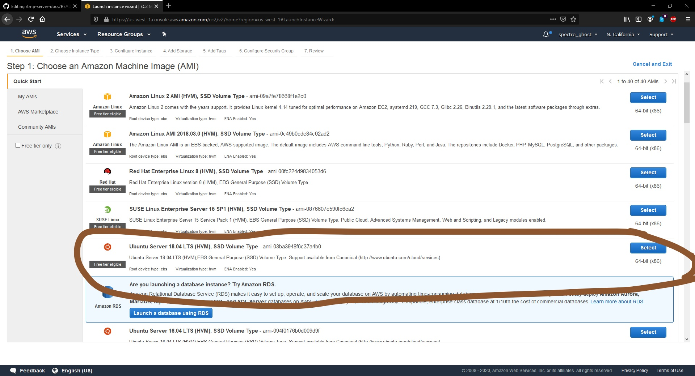

## How to stream to both Facebook live and YouTube live at the same time

Do you stream through facebook or youtube? Do you wish you could stream to both at the same time without paying hundreds of dollars for expensive software? Well, this guide will show you how!

First, a quick note. If you are running on a non-unix OS (e.g. Windows), you must get a bash command line. I recommend WSL, Windows Subsystem for Linux, but you could (in theory, not tested) use something like Git Bash.

---

You might ask "Why would I want to do this?" Well, there is one basic reason. Many poeple want or need to stream to both Facebook and YouTube at the same time. This is much easier if you download software, but for a business this can cost thousands of dollars a year. This is just not practical for smaller businesses. Most people stream like this:


Their stream just goes to one computer, then to the internet and one source. This is probably what you are doing right now. You *could* stream to two services by running two computers and two cameras, or splitting the output from one camera to two computers. An example of this is seen below:


The main problem with this is you need two operators, or one overtasked one, to get the job done. It also takes up a lot of bandwidth. A way to get around this is to send the stream to a local server which duplicates the stream and sends it to the two or more services. You can use a program like [vmix](https://www.vmix.com/) or [wirecast](https://www.telestream.net/wirecast/store.asp) to do this, but it will cost you money. Or you can run your own nginx-rmtp server to accomplish the same thing.


While this eliminated the two operators problem, it still takes up a lot of bandwidth. How do you get around this? Most people end up using expensive solutions such as [restream.io](restream.io). For one person this is really not a big deal, but if you are a business this can end up costing you thousands of dollars a year. Well, there is a better (and cheaper) alternative! Using AWS (Amazon Web Services), we can do the same thing as the last solution, but with half the bandwidth!


You send your stream to the server, then the server splits it up, sending it to your services. Since the server is not local, you are using the same bandwidth as just streaming to one service, because the bandwidth is being used in amazon's server.

Ok, so for the first step you need to sign up for an AWS account [here](https://portal.aws.amazon.com/billing/signup?nc2=h_ct&src=default&redirect_url=https%3A%2F%2Faws.amazon.com%2Fregistration-confirmation#/start). You will need a credit card, but since this tutorial will cover using the free tier, you should not be charged for it.

*EDIT:   In order to keep within the free tier, you must be vigilant about powering up the server **only** when you need it. This carries with it the issue that you might have made some small mistake in shutting it down, so when you power it up right before you need it, there is a bug that might take some time to fix. This being said, if you don't shut down the server, it will only cost about $15 a month, compared to $41 a month for restream, assuming you don't want a watermark on your stream. This estimate is taken with an activity of about 9 hours a month.*

Second, you need to create an *EC2* instance.


Select Ubuntu Server 18.05 LTS for your distro.



Click *Next: Configure Instance Details*. You will not need to do anyhting here, so click *Next: Add Storage*.
Again, this should not be messed with, so click *Next: Add Tags*, and click *Next: Configure Security Group*.

You will need to do some configuration on this portion of the setup. Add rules with these parameters:


| Port  | Inbound  | Service |
| ----- | -------  | ------- |
| 80    | Anywhere | HTTP    |
| 443   | Anywhere | HTTPS   |
| 22    | My IP    | SSH     |
| 1935  | My IP    | RTMP    |
| 19350 | My IP    | RTMPS   |


Note that this will allow you to access this server only from the computer you set this up on. In order to find your ip, look at the provided chart below.

|      Linux      |          macOS           |   Windows   |
|      -----      |          -----           |   -------   |
|   ifconfig -a   |  ipconfig getifaddr en1  |   ipconfig  |


Click *Review and Launch* to finish. Make sure that the security group's settings are correct, then click *Launch*.
Select *Create a new key pair* from the drop-down menu. Name it something memorable, download it, and select *Launch Instances*.
Now select *View Instances*. Copy the Puplic DNS.


Fire up a terminal in the directory in which you have the key pair. Run `sudo chmod 400 <yourkeypairname>.pem`.
Then, run `sudo ssh -i '<yourkeypairname>.pem' ubuntu@<yourpublicdns>`, replacing <yourpublicdns> with the string copied earlier. If all goes well, your terminal should ask you if you want to keep connecting. Type yes and hit enter. If you do not get this message and instead get something like "the host is not available at this time", just give it a few minutes and try again.
	
*EDIT:   On WSL, it is a little harder to access the files in order to run the above commands. Use [this](https://www.howtogeek.com/426749/how-to-access-your-linux-wsl-files-in-windows-10/) to know how to access your WSL file location. Once you have that, copy the* .pem *file into the WSL folder, then you should be able to run these commands.*

Once you are in, you are going to need to install a few things. Run these commands one at a time:

```sh
sudo apt-get update
sudo apt-get upgrade
sudo apt install nginx
sudo apt install libnginx-mod-rtmp
sudo apt-get install stunnel4
```

Once you are done, it is time to configure everything. First, sign into Facebook and start a new live stream. Check *Use persistent key*, and copy the key. Now, run `sudo nano /etc/nginx/nginx.conf`. In this file, append 
```sh
rtmp {
        server {
                listen 1935;
                chunk_size 4096;

                application live {
                        live on;
                        record off;
		                    push rtmp://a.rtmp.youtube.com/live2/<your youtube stream key>;
			                  push rtmp://127.0.0.1:19350/rtmp/<your persistent stream key>;
                }
        }
}
```
to after the http arguments, pasting the facebook stream key in it's spot. In all, your .conf file should look something like this:
```sh
# Important notes

Facebook is enforcing rtmps, so additional programs are required to do this. Please see the explanation for this on the stunnel. I actually got the info from this site, but remember that sites do change. I will include a PDF file of this into our Devonthink database.

`/etc/nginx/nginx.conf`

```sh
user www-data;
worker_processes auto;
pid /run/nginx.pid;
include /etc/nginx/modules-enabled/*.conf;

events {
	worker_connections 768;
	# multi_accept on;
}

http {

	##
	# Basic Settings
	##

	sendfile on;
	tcp_nopush on;
	tcp_nodelay on;
	keepalive_timeout 65;
	types_hash_max_size 2048;
	# server_tokens off;

	# server_names_hash_bucket_size 64;
	# server_name_in_redirect off;

	include /etc/nginx/mime.types;
	default_type application/octet-stream;

	##
	# SSL Settings
	##

	ssl_protocols TLSv1 TLSv1.1 TLSv1.2; # Dropping SSLv3, ref: POODLE
	ssl_prefer_server_ciphers on;

	##
	# Logging Settings
	##

	access_log /var/log/nginx/access.log;
	error_log /var/log/nginx/error.log;

	##
	# Gzip Settings
	##

	gzip on;

	# gzip_vary on;
	# gzip_proxied any;
	# gzip_comp_level 6;
	# gzip_buffers 16 8k;
	# gzip_http_version 1.1;
	# gzip_types text/plain text/css application/json application/javascript text/xml application/xml application/xml+rss text/javascript;

	##
	# Virtual Host Configs
	##

	include /etc/nginx/conf.d/*.conf;
	include /etc/nginx/sites-enabled/*;
}

rtmp {
        server {
                listen 1935;
                chunk_size 4096;

                application live {
                        live on;
                        record off;
		                    push rtmp://a.rtmp.youtube.com/live2/<your youtube stream key>;
			            push rtmp://127.0.0.1:19350/rtmp/<your persistent stream key>;
                }
        }
}

#mail {
#	# See sample authentication script at:
#	# http://wiki.nginx.org/ImapAuthenticateWithApachePhpScript
#
#	# auth_http localhost/auth.php;
#	# pop3_capabilities "TOP" "USER";
#	# imap_capabilities "IMAP4rev1" "UIDPLUS";
#
#	server {
#		listen     localhost:110;
#		protocol   pop3;
#		proxy      on;
#	}
#
#	server {
#		listen     localhost:143;
#		protocol   imap;
#		proxy      on;
#	}
#}
```
Alright, right now you would have to change this file every time you made a new stream. To change this, in YT Live select *Create New Stream Key* in the drop-down menu. 

Once you have created this key, go to the same drop-down menu and select your key name. Copy this key and paste it into the YT area of the nginx.conf file.

Third, you need to configure *stunnel*. Facebook enforces rtmp*s*, so stunnel will allow you to do both rtmp (YT), and rtmps (FB). Run `sudo nano /etc/stunnel/stunnel.conf`. You need to replace the file with this:
```sh
# /etc/default/stunnel
# Julien LEMOINE <speedblue@debian.org>
# September 2003

# Change to one to enable stunnel automatic startup
ENABLED=1
FILES="/etc/stunnel/*.conf"
OPTIONS=""

# Change to one to enable ppp restart scripts
PPP_RESTART=0

# Change to enable the setting of limits on the stunnel instances
# For example, to set a large limit on file descriptors (to enable
# more simultaneous client connections), set RLIMITS="-n 4096"
# More than one resource limit may be modified at the same time,
# e.g. RLIMITS="-n 4096 -d unlimited"
RLIMITS=""
```
Now you need to create a conf.d folder. Do this by running `sudo mkdir /etc/stunnel/conf.d` and `sudo cd /etc/stunnel/conf.d`.
Once in this folder, run `sudo nano fb.conf` and paste
```sh
[fb-live]
client = yes
accept = 127.0.0.1:19350
connect = live-api-s.facebook.com:443
verifyChain = no
```
into it.

Now you have finished configuring! Run `sudo systemctl start nginx && sudo systemctl start stunnel4`. If this is successful, you should be able to run `sudo systemctl status nginx` and `sudo systemctl status stunnel4`. If this isn't working, first make sure you followed the steps carefully, and if there is no error, Google it! Again, this will not work on WSL.

Alright. Now to get your software set up. To do this, go into the streaming settings. Select custom. For the server, paste in *rtmps://your ec2 public dns/live*. For the stream key, paste in your persistent fb stream key. Start streaming, and in a few moments you should see your video appear in both YouTube and Facebook at the same time! 

*EDIT:   You can theoretically use this method to stream to many, many more locations than* just *YT and FB. You can do this by adding more `push whatever-your-stream-url;` under the others in your `nginx.conf` file.*
